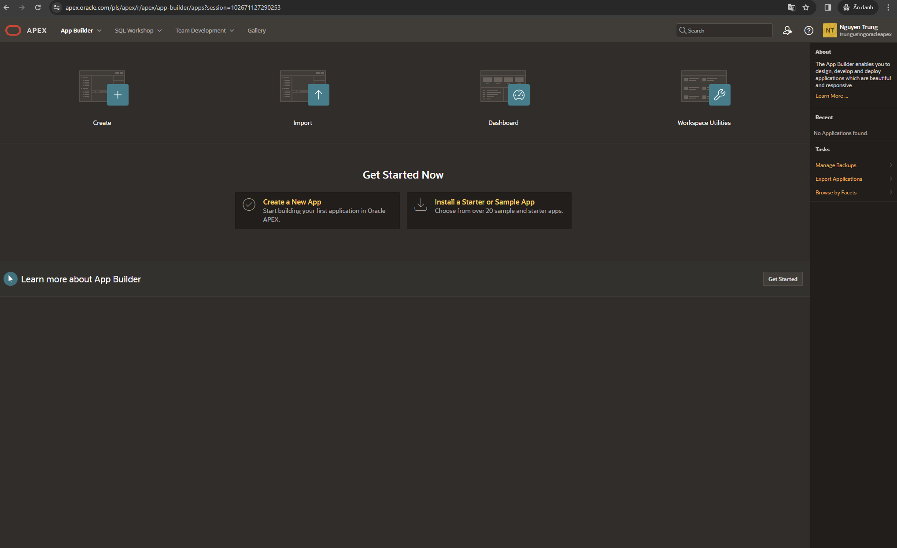
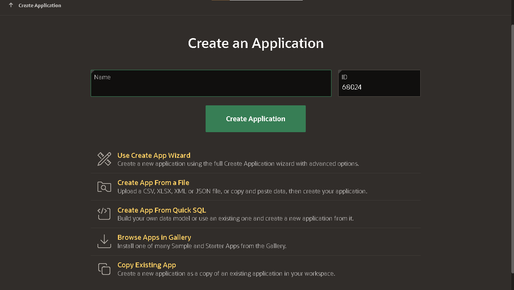

#### Software Engineering Advanced - HCMUT - Semester 232
##### Case Study and Practice:

###### About Low-Code Platform - Example with Oracle Apex Platform

1. Start with main App Builder Tools Menu:

We also has SQL Workshop to work with Database.

2.  We select Create App and Choose our Type of Application to Create:

### [LiveLab - Build a Social Media App](https://apex.oracle.com/go/sm-lab)

#### Objectives:
- Learn how to use Quick SQL
- Learn how to use a Form and a Cards Region including Dialogs
- Learn to work with BLOBs, Dynamic Actions and Custom Events

> [App Demo Link](https://apex.oracle.com/pls/apex/r/trungusingoracleapex/social-app-sample-lab)

> [App Demo Link](https://apex.oracle.com/pls/apex/r/trungusingoracleapex/world-population)